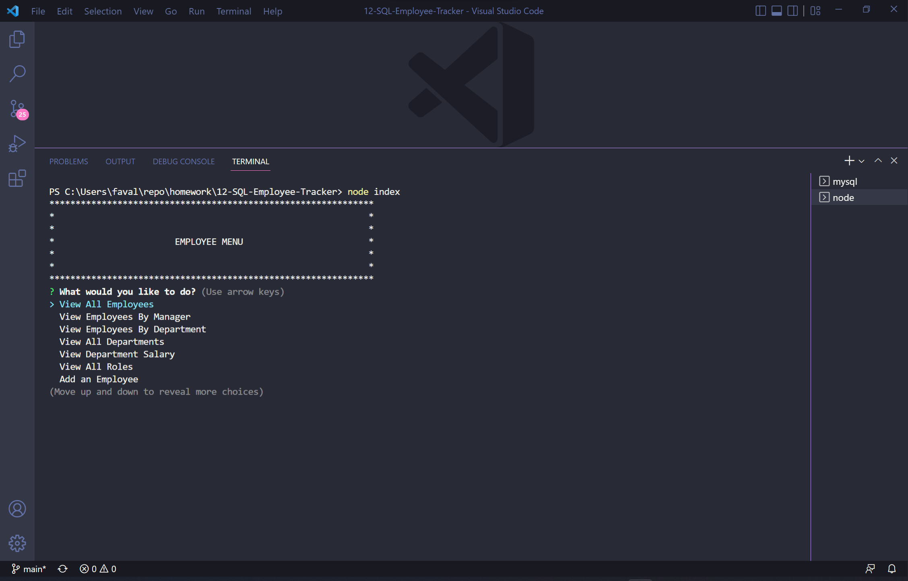

# 12 SQL: Employee Tracker

## Description
This project allows users to view and manage an employee database.

## Tablet of Contents
- [Installation](#installation)
- [Usage](#usage)
- [License](#license)
- [How to Contribute](#how-to-contribute)
- [Tests](#tests)
- [Questions](#questions)
- [Deployed Link](#deployed-link)

## Installation
Perform an npm install. Load the schema.sql and then the seeds.sql using the SOURCE method in the MySQL cli. Create your .env file and set the db name to 'employees_db', then set your db username and password. You can now run the program using 'node index'.

## Usage
Run the program using 'node index' and select the desired action from the list of options. The options allow users to view, add, and edit employees, roles, and departments within the database.

Link to Demo Video: https://drive.google.com/file/d/1JhFS9E30TaEkji2fxTixHkITQaiMUwPG/view?usp=sharing

Screenshot:

## License
ISC

## How to Contribute
Contact me via email and if I choose to do so, will grant you contrib access to the repo.

## Tests
N/A

## Questions
* Follow me on [GitHub](https://github.com/favalos06)
* Ask me questions at fernando.avalostorres91@gmail.com

## Deployed Link
https://favalos06.github.io/12-SQL-Employee-Tracker/
  